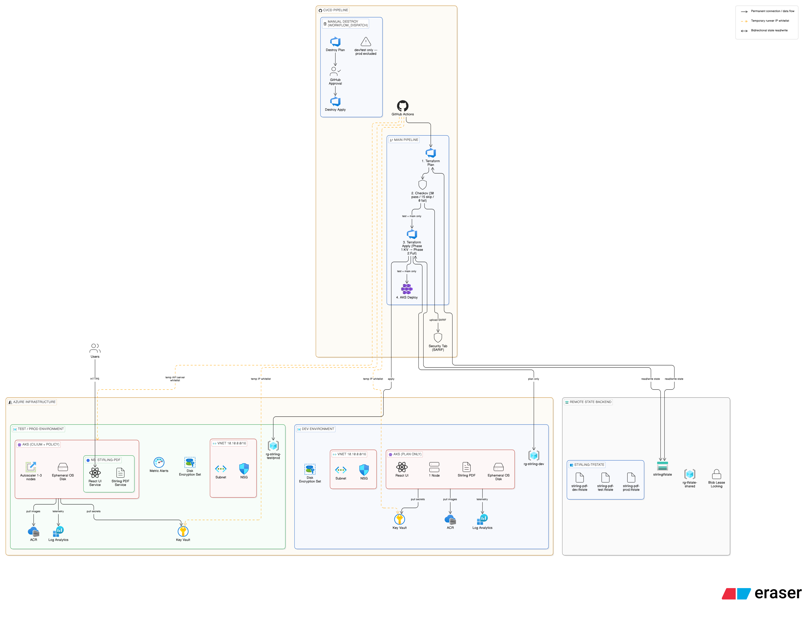
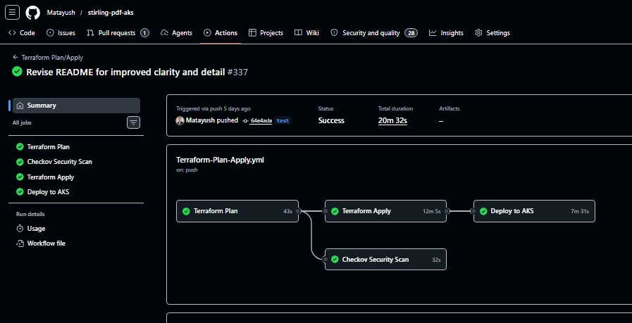
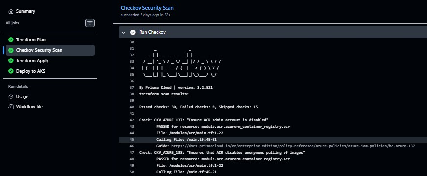
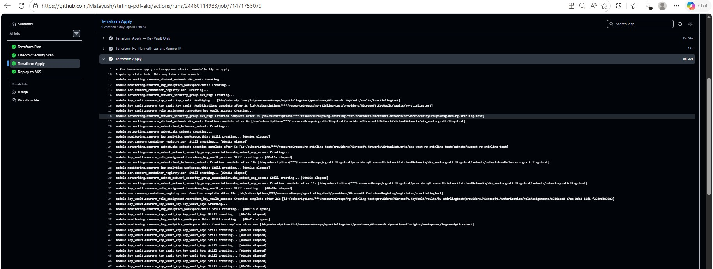
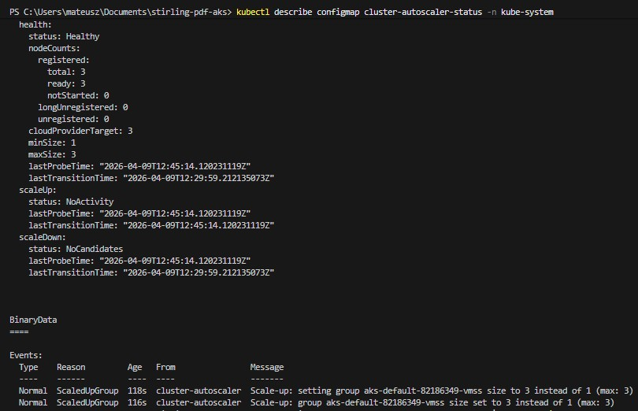
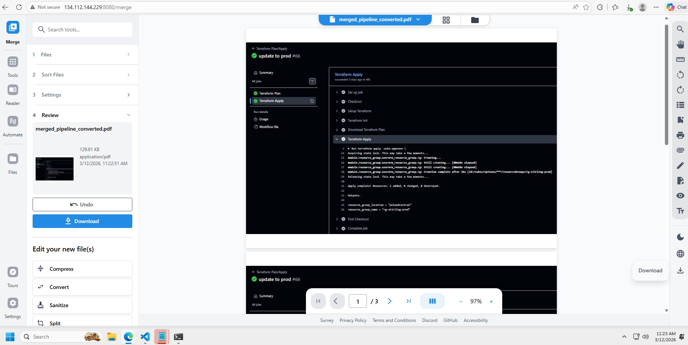

# 📄 Stirling PDF — Azure Kubernetes Service Deployment

<p align="center">
  
  
  
  
  
  
  
</p>

---

## 📌 About the Project

This project provisions a fully working, **security-hardened** deployment of **[Stirling PDF](https://github.com/Stirling-Tools/Stirling-PDF)** — a popular open-source PDF manipulation platform — on **Azure Kubernetes Service (AKS)**.

The infrastructure is fully modularised with **Terraform**, container images are stored in **Azure Container Registry (ACR)**, secrets are managed and rotated through **Azure Key Vault**, and the network layer uses **Azure CNI Overlay with Cilium**. The full lifecycle — plan, apply, deploy, and destroy — is orchestrated through **GitHub Actions CI/CD pipelines**.

Security and compliance are validated with **Checkov**, scanning both **Terraform** and **Kubernetes** manifests, with **SARIF** results uploaded to the GitHub Security tab. Findings are currently reported in **soft-fail mode**, giving visibility without blocking delivery.

---

## 🏗️ Architecture




## 🔐 Security Highlights

| Feature | Implementation |
|---|---|
| **Secrets Management** | Azure Key Vault with scheduled secret rotation |
| **Key Vault Protection** | Purge protection + soft-delete enabled |
| **Key Vault ACL** | Runner IP dynamically whitelisted before plan/apply/destroy and removed automatically |
| **Disk Encryption** | Host encryption + dedicated Disk Encryption Set backed by Key Vault |
| **OS Disks** | Ephemeral OS disks for improved performance and reduced persistence |
| **Network Policy** | Cilium eBPF-based network policy enforcement |
| **AKS API Server** | Restricted to authorised IPs; runner IP added temporarily during deployment and then removed |
| **Azure Policy** | Enabled on the AKS cluster |
| **IaC + Manifest Scanning** | Checkov scans **Terraform** and **Kubernetes** manifests and uploads SARIF to GitHub Security |
| **Compliance Status** | ✅ 30 passed · ⏭️ 15 skipped with documented justification · 🚫 0 failed |
| **Node Upgrades** | Automatic patch channel + NodeImage OS updates |
| **Destroy Protection** | `prod` is excluded from the destroy workflow; only `dev` and `test` can be selected |

---

## 🧰 Tech Stack

| Technology | Purpose |
|---|---|
| **Microsoft Azure** | Cloud provider |
| **AKS** | Managed Kubernetes cluster with Cluster Autoscaler |
| **Azure Container Registry** | Docker image storage |
| **Azure Key Vault** | Secret management, rotation, purge protection, encryption integration |
| **Azure Monitor + Log Analytics** | Observability and logging |
| **Azure CNI Overlay + Cilium** | Advanced networking and pod-level network policy |
| **Terraform** | Modular Infrastructure as Code |
| **Checkov (Prisma Cloud)** | Static IaC and Kubernetes manifest scanning |
| **GitHub Actions** | CI/CD — plan/apply pipeline plus protected destroy workflow |
| **Stirling PDF** | PDF processing backend |
| **React** | Frontend UI |

---

## 📁 Project Structure

```text
stirling-pdf-aks/
├── .github/
│   └── workflows/
│       ├── Terraform-Plan-Apply.yml    # Plan → Checkov → Apply → AKS Deploy
│       └── Terraform-Destroy-All.yml   # Manual destroy with confirmation and approval gate
├── k8s/
│   ├── namespace.yaml
│   ├── configmap-frontend.yaml
│   ├── configmap-backend.yaml
│   ├── deployment-frontend.yaml
│   ├── deployment-backend.yaml
│   ├── service-frontend.yaml
│   └── service-backend.yaml
├── modules/
│   ├── acr/
│   ├── aks/
│   ├── key_vault/
│   ├── monitoring/
│   ├── networking/
│   └── resource_group/
├── main.tf
├── variables.tf
├── outputs.tf
├── backend.tf
├── versions.tf
└── .terraform.lock.hcl
```

---

## ⚙️ Configuration

| Variable | Description |
|---|---|
| `environment` | Derived from branch name (`dev`, `test`, `prod`) |
| `location` | Azure region supplied through GitHub Actions variable |
| `resource_group_name` | Environment-specific resource group resolved in workflow |
| `allowed_ips` | Static allowed IPs injected from GitHub Actions variables |
| `vnet_cidr` | Virtual network CIDR |
| `service_cidr` | Kubernetes service CIDR |
| `dns_service_ip` | Kubernetes DNS service IP |
| `vm_size` | AKS node VM size |

---

## 🗄️ Remote State Management

Terraform state is stored remotely in **Azure Blob Storage** using a dedicated backend hosted in its own resource group, separated from application resources.

```hcl
terraform {
  required_providers {
    azurerm = {
      source  = "hashicorp/azurerm"
      version = "~> 4.60.0"
    }
  }

  backend "azurerm" {
    resource_group_name  = "rg-tfstate-shared"
    storage_account_name = "stirlingtfstate"
    container_name       = "stirling-tfstate"
  }
}
```

The **state key is selected dynamically per branch**, which keeps environments isolated while using one shared backend container and Azure Blob lease locking.

| Branch | Environment | State file |
|---|---|---|
| `dev` | `dev` | `stirling-pdf-dev.tfstate` |
| `test` | `test` | `stirling-pdf-test.tfstate` |
| `main` | `prod` | `stirling-pdf-prod.tfstate` |

> ⚠️ Azure credentials are **never committed**. They are injected at runtime through GitHub Actions secrets.

---

## 🔑 GitHub Actions Secrets & Variables

Configure these under **Settings → Secrets and variables → Actions**.

### Secrets

| Secret | Description |
|---|---|
| `ARM_CLIENT_ID` | Azure Service Principal App ID |
| `ARM_CLIENT_SECRET` | Azure Service Principal password |
| `ARM_SUBSCRIPTION_ID` | Azure Subscription ID |
| `ARM_TENANT_ID` | Azure Tenant ID |

### Variables

| Variable | Description |
|---|---|
| `ALLOWED_IPS` | JSON array of static IPs used in Key Vault and AKS ACL logic |
| `location` | Azure region used by Terraform |

---

## 🔁 CI/CD Pipelines

### Terraform Plan / Apply workflow

This workflow triggers on **push** and **pull request** for `dev`, `test`, and `main`.

#### Pipeline flow

```text
push / PR to dev | test | main
        │
        ▼
┌────────────────────┐     ┌────────────────────┐
│  terraform-plan    │────▶│  checkov-scan      │
│  (all branches)    │     │  (tf + k8s)        │
└─────────┬──────────┘     └────────────────────┘
          │ exit code == 2
          │ main or test only
          ▼
┌────────────────────┐
│  terraform-apply   │
│  (two-phase apply) │
└─────────┬──────────┘
          ▼
┌────────────────────┐
│  k8s-deploy        │
│  (AKS manifests)   │
└────────────────────┘
```

#### Job details

| Job | Runs on | What it does |
|---|---|---|
| `terraform-plan` | All branches, push + PR | Sets backend key and environment, runs `init`, `validate`, `fmt -check`, `plan`, and posts plan output to PR comments |
| `checkov-scan` | All branches | Scans Terraform and Kubernetes manifests, exports SARIF, uploads results to GitHub Security |
| `terraform-apply` | `main` and `test` only | Runs only when Terraform plan exit code is `2`; applies Key Vault first, re-plans with runner IP, then applies full infrastructure |
| `k8s-deploy` | After successful apply on `main` and `test` | Temporarily whitelists runner IP on AKS API server, deploys manifests, restores previous IP ranges |

#### Branch behaviour

| Branch / Event | Plan | Checkov | Apply | Deploy |
|---|---|---|---|---|
| `dev` push | ✅ | ✅ | ❌ | ❌ |
| `test` push | ✅ | ✅ | ✅ | ✅ |
| `main` push | ✅ | ✅ | ✅ | ✅ |
| Pull Request | ✅ | ✅ | ❌ | ❌ |

#### Key implementation details

- **Concurrency per branch** reduces Terraform state collision risk.
- **PR plan comments** make infrastructure changes reviewable in pull requests.
- **Checkov runs with `soft_fail: true`**, so findings are visible without failing the pipeline.
- **Runner IP is dynamically added and removed** for both Key Vault and AKS API access.
- **Two-phase apply** ensures Key Vault exists before ACL-dependent operations run.

---

### Terraform Destroy workflow

This workflow is triggered manually via **`workflow_dispatch`** and is deliberately restricted.

#### Protection layers

1. **Typed confirmation**
   - The user must type exactly `destroy`.

2. **Environment selection**
   - Only `dev` and `test` are allowed.
   - `prod` is intentionally excluded.

3. **GitHub Environment approval**
   - The destroy apply job uses the selected GitHub Environment.
   - This allows a reviewer approval gate before execution.

#### Destroy flow

```text
workflow_dispatch
  ├── environment: [dev | test]
  └── confirm: "destroy"
          │
          ▼
  terraform-destroy-plan
          │
          ├── publishes destroy plan to summary
          ├── uploads plan as artifact
          ▼
  reviewer approval via GitHub Environment
          ▼
  terraform-destroy-apply
```

#### Destroy workflow details

| Job | What it does |
|---|---|
| `terraform-destroy-plan` | Runs `plan -destroy`, publishes plan to Actions summary, uploads plan artifact |
| `terraform-destroy-apply` | Downloads the approved plan artifact and executes `terraform apply` against it |

This setup gives you a **double confirmation model**: typed confirmation plus reviewer approval.

---

## 📋 Prerequisites

- [Azure CLI](https://learn.microsoft.com/en-us/cli/azure/install-azure-cli)
- [Terraform](https://developer.hashicorp.com/terraform/install) >= 1.0
- [kubectl](https://kubernetes.io/docs/tasks/tools/)
- [Checkov](https://www.checkov.io/) for local scanning
- Active Azure subscription
- GitHub repository secrets and variables configured

---

## 🚀 Local Deployment

### 1️⃣ Clone the repository

```bash
git clone https://github.com/Matayush/stirling-pdf-aks.git
cd stirling-pdf-aks
```

### 2️⃣ Run Checkov locally (optional)

```bash
checkov -d . --framework terraform,kubernetes
```

### 3️⃣ Initialise Terraform backend

```bash
terraform init -backend-config="key=stirling-pdf-dev.tfstate"
```

### 4️⃣ Plan infrastructure

```bash
terraform plan \
  -var "environment=dev" \
  -var "location=westeurope" \
  -var "resource_group_name=rg-stirling-dev"
```

### 5️⃣ Apply infrastructure

```bash
terraform apply \
  -var "environment=dev" \
  -var "location=westeurope" \
  -var "resource_group_name=rg-stirling-dev"
```

### 6️⃣ Connect to AKS

```bash
az aks get-credentials --resource-group rg-stirling-dev --name aks-dev
```

### 7️⃣ Deploy Kubernetes manifests

```bash
kubectl apply -f k8s/
```

### 8️⃣ Verify deployment

```bash
kubectl get pods -A
kubectl get svc -A
```

---

## 🧹 Cleanup

### Via GitHub Actions

Use the **Terraform Destroy** workflow from the Actions tab:
- Select `dev` or `test`
- Type `destroy`
- Approve the protected environment if required

### Locally

```bash
terraform destroy \
  -var "environment=dev" \
  -var "location=westeurope" \
  -var "resource_group_name=rg-stirling-dev"
```

---

## 🗺️ Roadmap

- [x] Checkov IaC + manifest scanning integrated (soft-fail mode)
- [x] Cluster Autoscaler — verified scaling from 1 to 3 nodes
- [ ] Move Checkov from `soft_fail: true` to enforced compliance gate
- [ ] Migrate Kubernetes manifests to Helm charts
- [ ] Integrate Trivy image scanning in CI or ACR
- [ ] Add full Azure Monitor / Container Insights verification

---

## 📸 Screenshots

### Architecture Overview


### CI/CD Pipeline — All Jobs Passing


### Checkov Security Scan — 30 Passed / 0 Failed


### Terraform Apply — Live Infrastructure Provisioning


### Cluster Autoscaler — Scaling from 1 to 3 Nodes


### Stirling PDF Running on AKS


---

## 👤 Author

**Mateusz Ceniuk** — Cloud & Infrastructure Engineer based in Kraków 🇵🇱

[](https://www.linkedin.com/in/mateuszceniuk/)
[](https://github.com/Matayush)
[](mailto:ceniuk.mateusz@gmail.com)

---

> 💡 *This project is part of my personal cloud engineering portfolio. Feel free to fork it, use it, or reach out if you have any questions!*
